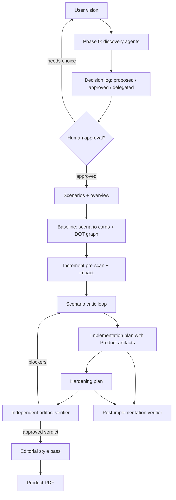
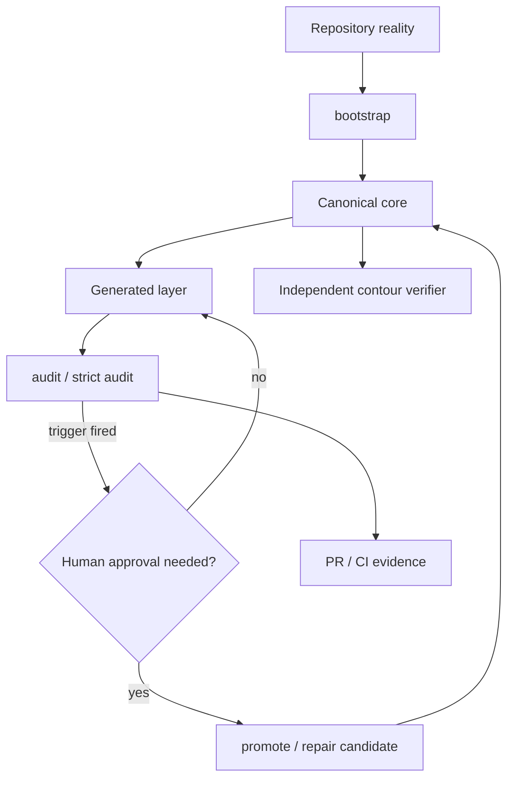

# Knowledge Contour Skills

Language: **English** | [Русский](README.ru.md)

This repository contains ready-to-install Codex skills: self-contained folders
with `SKILL.md`, agent prompt files, references, scripts, and tests.

## Skills

### `product-workflow`

End-to-end product shaping: discovery, decision log, PRD, user scenarios,
current-scenario baseline, feature impact analysis, implementation plan,
hardening plan, independent verification, editorial pass, and stakeholder-facing
PDF.

Use it for product or feature descriptions, roadmap validation, scenario design,
and implementation planning. For existing products, the `baseline` mode captures
current scenarios as `current-scenario-baseline.md`, `scenario-cards.md`, and
`scenario-graph.dot`; new increments then declare affected scenarios through
pre-scan and impact artifacts before implementation planning. By default, the
PDF includes only the product problem, scenarios, chosen solution, and
independent verdict; T/H plans remain engineering artifacts.



Contents:

- `SKILL.md` — main workflow and gates.
- `agents/` — discovery, critic, verifier, and style-editor prompts.
- `references/` — templates for scenarios, baseline, scenario cards,
  increment pre-scan/impact, decision log, plans, and PDF.
- `scripts/verify_artifacts.py` — structural checks for scenarios,
  baseline/pre-scan/impact artifacts, plans, hardening plans, and validation
  gate.
- `scripts/build_pdf.sh` — PDF assembly with mandatory independent validation.
- `evals/` — expected-behavior eval set.

### `service-knowledge-contour`

Minimal knowledge contour for one service repository: startup docs, canonical
`SERVICE_MAP.md` / `VERIFY.md`, knowledge-gap registry, generated overlays,
audit, promotion, and pruning.

Use it when a service needs a stable operating knowledge layer for humans and
agents, onboarding docs are missing or fragmented, or topology, entrypoints,
verification commands, integrations, or risk zones changed.



Contents:

- `SKILL.md` — service knowledge contour workflow and rules.
- `agents/contour-verifier.md` — independent semantic contour verification.
- `bin/` — bootstrap, refresh, audit, promote, and prune shell scripts.
- `examples/` — GitHub Actions and PR template examples.
- `tests/` — bootstrap/audit contract tests.

## Install In Codex

Install a skill by pointing Codex at the repository folder URL.

Ask Codex:

```text
Install the skill from https://github.com/ehlyzov/skills/tree/main/product-workflow
```

or:

```text
Install the skill from https://github.com/ehlyzov/skills/tree/main/service-knowledge-contour
```

Manual install:

```bash
mkdir -p ~/.codex/skills
cp -R product-workflow ~/.codex/skills/
cp -R service-knowledge-contour ~/.codex/skills/
```

Update an installed copy:

```bash
rm -rf ~/.codex/skills/product-workflow ~/.codex/skills/service-knowledge-contour
cp -R product-workflow service-knowledge-contour ~/.codex/skills/
```

Verify installation:

```bash
test -f ~/.codex/skills/product-workflow/SKILL.md
test -f ~/.codex/skills/service-knowledge-contour/SKILL.md
```

## Install In Claude Code

Add this repository as a Claude Code plugin marketplace:

```text
/plugin marketplace add ehlyzov/skills
```

or, with the full Git URL:

```text
/plugin marketplace add https://github.com/ehlyzov/skills.git
```

Then install one or both plugins from the marketplace:

```text
/plugin install product-workflow@knowledge-contour-skills
/plugin install service-knowledge-contour@knowledge-contour-skills
```

The marketplace file is stored at `.claude-plugin/marketplace.json`, which is
the path Claude Code expects when adding a GitHub repository as a plugin
marketplace.

## Run Scripts

Running scripts is separate from installing a skill.

For `product-workflow`, run scripts from the skill folder or by absolute path to
the installed skill:

```bash
python3 product-workflow/scripts/verify_artifacts.py --phase scenarios <repo-root>
python3 product-workflow/scripts/verify_artifacts.py --phase baseline <repo-root>
python3 product-workflow/scripts/verify_artifacts.py --phase pre-scan <repo-root>
python3 product-workflow/scripts/verify_artifacts.py --phase impact <repo-root>
python3 product-workflow/scripts/verify_artifacts.py --phase plan <repo-root>
python3 product-workflow/scripts/verify_artifacts.py --phase hardening <repo-root>
python3 product-workflow/scripts/verify_artifacts.py --phase validation <repo-root>
bash product-workflow/scripts/build_pdf.sh <repo-root> ~/Downloads/product-docs.pdf
```

`--phase pre-scan` and `--phase impact` are explicit increment checks: they
require corresponding files under `docs/product/increments/`. `--phase all`
accepts a baseline-only product snapshot with no active increment files.

New T/H plans must include `Product artifacts` in every task. Existing legacy
plans can be checked during migration with:

```bash
python3 product-workflow/scripts/verify_artifacts.py --phase all <repo-root> --allow-legacy-plan
```

`build_pdf.sh` requires a fresh `docs/product/validation/verdict.md` by default
and excludes implementation/hardening plans. Use an explicit flag for internal
engineering PDFs:

```bash
INCLUDE_ENGINEERING_PLANS=1 bash product-workflow/scripts/build_pdf.sh <repo-root> ~/Downloads/internal-product-docs.pdf
```

For `service-knowledge-contour`, scripts are copied or run inside the target
service repository as an operating toolchain:

```bash
./bin/bootstrap.sh
./bin/refresh_contour.sh --check
./bin/audit_contour.sh --strict
./bin/promote_learning.sh --input-file /tmp/learning.txt
./bin/prune_contour.sh
```

Do not copy the whole skill folder into a service repository. Target service
repositories should receive only the needed `bin/*` scripts or the contour
created by bootstrap, not `SKILL.md`, tests, and prompt files.

## Verify This Repository

```bash
python3 -m py_compile product-workflow/scripts/verify_artifacts.py
bash -n product-workflow/scripts/build_pdf.sh service-knowledge-contour/bin/*.sh
pytest -q tests/product_workflow service-knowledge-contour/tests
```

Basic skill-folder validation:

```bash
python3 ~/.codex/skills/.system/skill-creator/scripts/quick_validate.py product-workflow
python3 ~/.codex/skills/.system/skill-creator/scripts/quick_validate.py service-knowledge-contour
```

If `PyYAML` is missing in the current environment, install it into the active
Python env or run validation in the Codex environment where dependencies are
available.

## Maintenance Rules

- The canonical entry point for every skill is `SKILL.md`.
- All agent prompt files in `agents/` are written in English.
- If the skill request or target artifacts are Russian-language, agents must
  produce polished Russian user-facing text.
- Additional materials should live in `agents/`, `references/`, `scripts/`,
  `assets/`, `examples/`, `tests/`, or `evals/`.
- Do not add README files inside skill folders without a separate reason; this
  root file documents the skill set.
- Scripts must stay executable when the workflow invokes them directly.
- Generated overlays and PDFs are not source of truth and must not replace the
  markdown canon.
