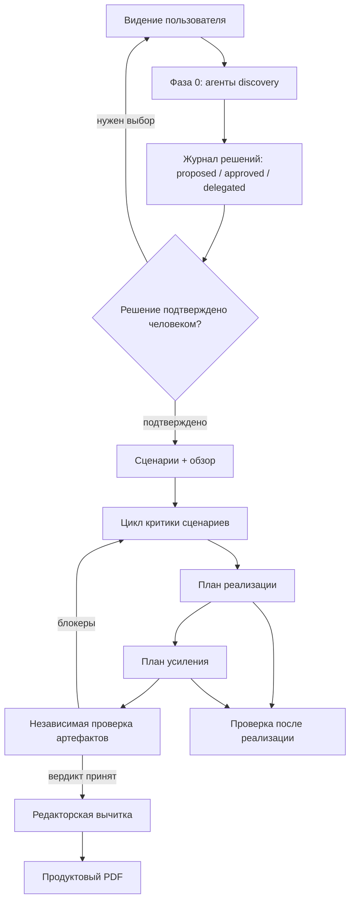
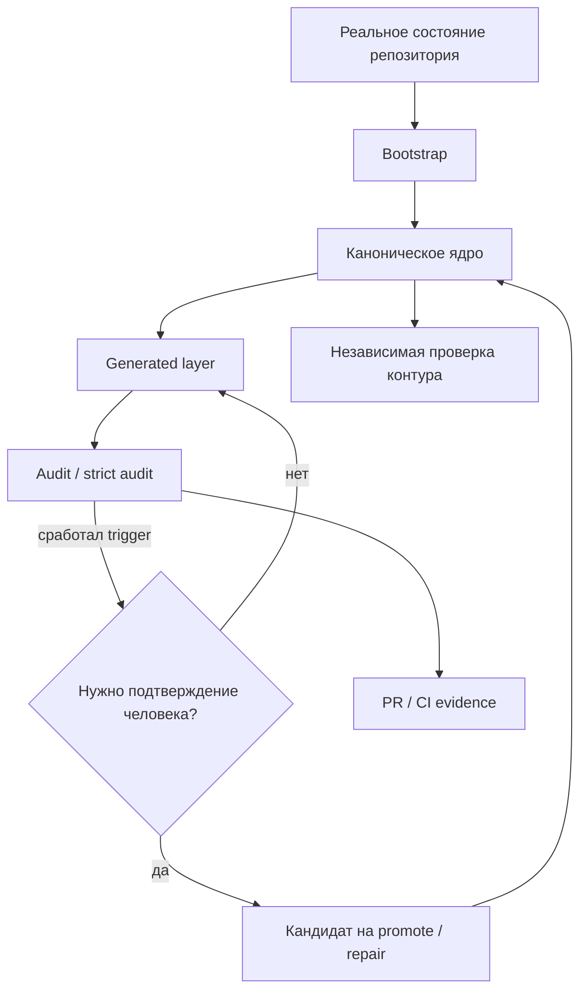

# Knowledge Contour Skills

Язык: [English](README.md) | **Русский**

Репозиторий содержит готовые Codex skills: самодостаточные папки с `SKILL.md`,
prompt-файлами для агентов, reference-документами, скриптами и проверками.

## Навыки

### `product-workflow`

Сквозная продуктовая проработка: discovery, журнал решений, PRD, пользовательские
сценарии, implementation plan, hardening plan, независимая проверка, редакторская
вычитка и stakeholder-facing PDF.

Используется для продуктового описания фичи или продукта, roadmap-проверки,
подготовки сценариев и планов реализации. По умолчанию PDF содержит только
продуктовую постановку, сценарии, выбранное решение и независимый verdict;
T/H-планы остаются инженерными артефактами.



Состав:

- `SKILL.md` — основной workflow и gates.
- `agents/` — discovery, critic, verifier и style-editor prompts.
- `references/` — шаблоны сценариев, overview, decision log, планов и PDF.
- `scripts/verify_artifacts.py` — машинные проверки структуры и validation gate.
- `scripts/build_pdf.sh` — сборка PDF с обязательной независимой проверкой.
- `evals/` — eval-набор для ожидаемого поведения навыка.

### `service-knowledge-contour`

Минимальный knowledge contour для одного service-репозитория: startup docs,
канонические `SERVICE_MAP.md` / `VERIFY.md`, реестр knowledge gaps, generated
overlays, audit, promotion и pruning.

Используется, когда сервису нужен устойчивый операционный слой знаний для людей
и агентов, когда onboarding-документы отсутствуют или разъехались, либо когда
изменились topology, entrypoints, verification commands, integrations или risk
zones.



Состав:

- `SKILL.md` — правила и workflow поддержания service knowledge contour.
- `agents/contour-verifier.md` — независимая semantic-проверка полезности контура.
- `bin/` — shell-скрипты bootstrap, refresh, audit, promote и prune.
- `examples/` — пример GitHub Actions проверки и PR template.
- `tests/` — контрактные проверки bootstrap/audit поведения.

## Установка в Codex

Установить навыки можно по ссылке на папку в репозитории.

В Codex попросите:

```text
Установи skill из https://github.com/ehlyzov/skills/tree/main/product-workflow
```

или:

```text
Установи skill из https://github.com/ehlyzov/skills/tree/main/service-knowledge-contour
```

Ручная установка:

```bash
mkdir -p ~/.codex/skills
cp -R product-workflow ~/.codex/skills/
cp -R service-knowledge-contour ~/.codex/skills/
```

Обновление установленной версии:

```bash
rm -rf ~/.codex/skills/product-workflow ~/.codex/skills/service-knowledge-contour
cp -R product-workflow service-knowledge-contour ~/.codex/skills/
```

Проверить, что навыки установлены:

```bash
test -f ~/.codex/skills/product-workflow/SKILL.md
test -f ~/.codex/skills/service-knowledge-contour/SKILL.md
```

## Запуск скриптов

Это отдельная операция от установки skill.

Для `product-workflow` скрипты запускаются из папки навыка или по абсолютному
пути к установленному skill:

```bash
python3 product-workflow/scripts/verify_artifacts.py --phase scenarios <repo-root>
python3 product-workflow/scripts/verify_artifacts.py --phase validation <repo-root>
bash product-workflow/scripts/build_pdf.sh <repo-root> ~/Downloads/product-docs.pdf
```

`build_pdf.sh` по умолчанию требует свежий
`docs/product/validation/verdict.md` и не включает implementation/hardening
планы. Для внутреннего инженерного PDF нужен явный флаг:

```bash
INCLUDE_ENGINEERING_PLANS=1 bash product-workflow/scripts/build_pdf.sh <repo-root> ~/Downloads/internal-product-docs.pdf
```

Для `service-knowledge-contour` скрипты копируются или запускаются в целевом
service-репозитории как операционный toolchain:

```bash
./bin/bootstrap.sh
./bin/refresh_contour.sh --check
./bin/audit_contour.sh --strict
./bin/promote_learning.sh --input-file /tmp/learning.txt
./bin/prune_contour.sh
```

Не копируйте всю папку skill в service-репозиторий. В service-репозиторий
должны попадать только нужные `bin/*` scripts или установленный через bootstrap
knowledge contour, а не `SKILL.md`, tests и prompt-файлы.

## Проверка репозитория навыков

```bash
python3 -m py_compile product-workflow/scripts/verify_artifacts.py
bash -n product-workflow/scripts/build_pdf.sh service-knowledge-contour/bin/*.sh
pytest -q tests/product_workflow service-knowledge-contour/tests
```

Для базовой проверки формата skill folders:

```bash
python3 ~/.codex/skills/.system/skill-creator/scripts/quick_validate.py product-workflow
python3 ~/.codex/skills/.system/skill-creator/scripts/quick_validate.py service-knowledge-contour
```

Если в окружении нет `PyYAML`, установите его в используемый Python env или
запустите проверку в окружении Codex, где зависимости уже доступны.

## Правила поддержки

- Канонический вход в каждый навык — `SKILL.md`.
- Все prompt-файлы агентов в `agents/` пишутся на английском.
- Если запрос навыка или целевые артефакты русскоязычные, агенты должны писать
  итоговый пользовательский текст на хорошем русском языке.
- Дополнительные материалы должны лежать рядом с навыком в `agents/`,
  `references/`, `scripts/`, `assets/`, `examples/`, `tests/` или `evals/`.
- Не добавляйте README внутрь папок навыков без отдельной причины: описание
  набора навыков хранится в этом корневом файле.
- Скрипты должны оставаться исполняемыми, если workflow вызывает их напрямую.
- Generated overlays и PDF не являются source of truth и не должны подменять
  markdown-канон.
