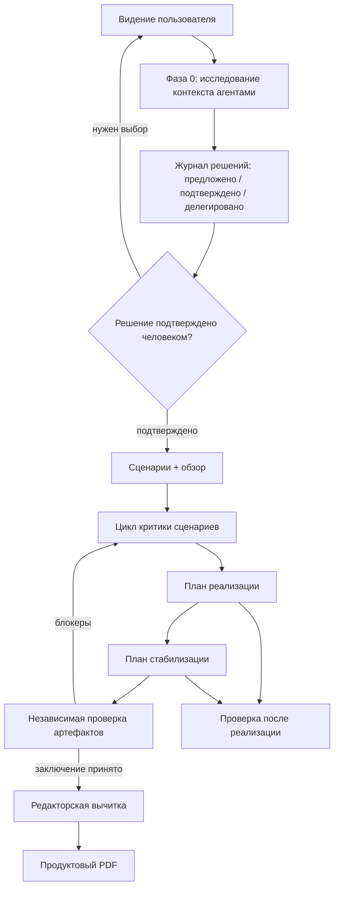
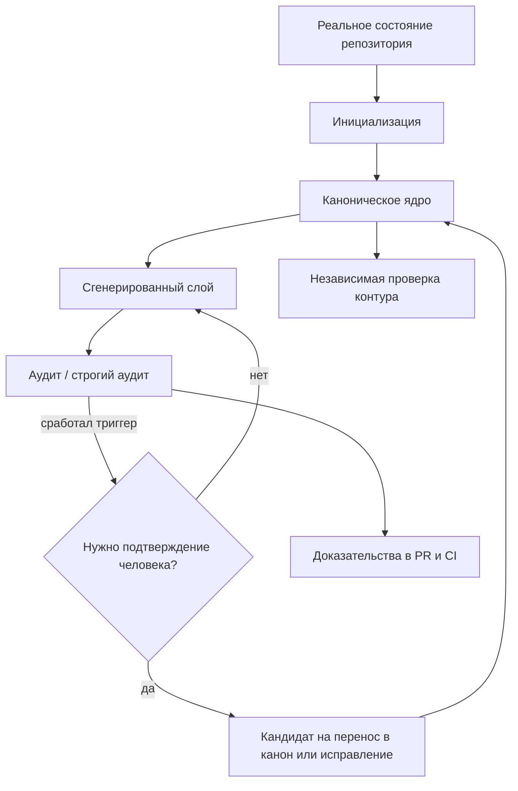

# Knowledge Contour Skills

Язык: [English](README.md) | **Русский**

Этот репозиторий содержит готовые навыки Codex: самодостаточные папки с
`SKILL.md`, инструкциями для агентов, справочными материалами, скриптами и
тестами.

## Навыки

### `product-workflow`

Сквозная продуктовая проработка: исследование контекста, журнал решений,
продуктовые требования (PRD), пользовательские сценарии, план реализации, план
стабилизации перед запуском, независимая проверка, редакторская вычитка и
итоговый PDF для обсуждения с заинтересованными сторонами.

Навык подходит для описания продукта или крупной функции, проверки дорожной
карты, подготовки пользовательских сценариев и планирования реализации. По
умолчанию итоговый PDF содержит только продуктовую постановку, сценарии,
выбранное решение и независимое заключение. Планы реализации и стабилизации
остаются внутренними инженерными артефактами.



Состав:

- `SKILL.md` — основной процесс и контрольные точки.
- `agents/` — инструкции для агентов исследования, критики, проверки и
  редакторской вычитки.
- `references/` — шаблоны сценариев, обзора, журнала решений, планов и PDF.
- `scripts/verify_artifacts.py` — машинные проверки структуры и содержательных
  условий.
- `scripts/build_pdf.sh` — сборка PDF с обязательной независимой проверкой.
- `evals/` — набор проверочных примеров для ожидаемого поведения навыка.

### `service-knowledge-contour`

Минимальный контур знаний для одного репозитория сервиса: стартовая
документация, канонические `SERVICE_MAP.md` и `VERIFY.md`, реестр пробелов в
знаниях, сгенерированные слои, аудит, перенос устойчивых знаний в канон и
очистка устаревших материалов.

Навык используется, когда сервису нужен устойчивый операционный слой знаний для
людей и агентов, когда документация для входа в проект отсутствует или
противоречит коду, а также после изменений в топологии, точках входа, командах
проверки, интеграциях или зонах риска.



Состав:

- `SKILL.md` — правила и процесс поддержки контура знаний сервиса.
- `agents/contour-verifier.md` — независимая смысловая проверка полезности
  контура.
- `bin/` — скрипты командной оболочки для инициализации, обновления, аудита,
  переноса знаний в канон и очистки.
- `examples/` — примеры проверки GitHub Actions и шаблона запроса на слияние.
- `tests/` — контрактные проверки инициализации и аудита.

## Установка в Codex

Навык можно установить, передав Codex ссылку на соответствующую папку в
репозитории.

В Codex попросите:

```text
Установи навык по ссылке https://github.com/ehlyzov/skills/tree/main/product-workflow
```

или:

```text
Установи навык по ссылке https://github.com/ehlyzov/skills/tree/main/service-knowledge-contour
```

Ручная установка:

```bash
mkdir -p ~/.codex/skills
cp -R product-workflow ~/.codex/skills/
cp -R service-knowledge-contour ~/.codex/skills/
```

Обновление установленной версии:

```bash
rm -rf ~/.codex/skills/product-workflow ~/.codex/skills/service-knowledge-contour
cp -R product-workflow service-knowledge-contour ~/.codex/skills/
```

Проверить, что навыки установлены:

```bash
test -f ~/.codex/skills/product-workflow/SKILL.md
test -f ~/.codex/skills/service-knowledge-contour/SKILL.md
```

## Запуск скриптов

Запуск скриптов не входит в установку навыка и выполняется отдельно.

Для `product-workflow` скрипты запускаются из папки навыка или по абсолютному
пути к установленному навыку:

```bash
python3 product-workflow/scripts/verify_artifacts.py --phase scenarios <repo-root>
python3 product-workflow/scripts/verify_artifacts.py --phase validation <repo-root>
bash product-workflow/scripts/build_pdf.sh <repo-root> ~/Downloads/product-docs.pdf
```

`build_pdf.sh` по умолчанию требует свежий
`docs/product/validation/verdict.md` и не включает планы реализации и
стабилизации. Для внутреннего инженерного PDF нужен явный флаг:

```bash
INCLUDE_ENGINEERING_PLANS=1 bash product-workflow/scripts/build_pdf.sh <repo-root> ~/Downloads/internal-product-docs.pdf
```

Для `service-knowledge-contour` скрипты копируются или запускаются в целевом
репозитории сервиса как операционный набор инструментов:

```bash
./bin/bootstrap.sh
./bin/refresh_contour.sh --check
./bin/audit_contour.sh --strict
./bin/promote_learning.sh --input-file /tmp/learning.txt
./bin/prune_contour.sh
```

Не копируйте всю папку навыка в репозиторий сервиса. В целевой репозиторий
должны попадать только нужные скрипты `bin/*` или контур знаний, созданный при
инициализации. `SKILL.md`, тесты и инструкции для агентов там не нужны.

## Проверка репозитория навыков

```bash
python3 -m py_compile product-workflow/scripts/verify_artifacts.py
bash -n product-workflow/scripts/build_pdf.sh service-knowledge-contour/bin/*.sh
pytest -q tests/product_workflow service-knowledge-contour/tests
```

Для базовой проверки структуры папок навыков:

```bash
python3 ~/.codex/skills/.system/skill-creator/scripts/quick_validate.py product-workflow
python3 ~/.codex/skills/.system/skill-creator/scripts/quick_validate.py service-knowledge-contour
```

Если в окружении нет `PyYAML`, установите его в активное окружение Python или
запустите проверку в окружении Codex, где зависимости уже доступны.

## Правила поддержки

- Канонический вход в каждый навык — `SKILL.md`.
- Все инструкции для агентов в `agents/` пишутся на английском.
- Если запрос к навыку или целевые артефакты написаны на русском, агенты должны
  готовить итоговый пользовательский текст на хорошем русском языке.
- Дополнительные материалы должны лежать рядом с навыком в `agents/`,
  `references/`, `scripts/`, `assets/`, `examples/`, `tests/` или `evals/`.
- Не добавляйте README внутрь папок навыков без отдельной причины: описание
  набора навыков хранится в этом корневом файле.
- Скрипты должны оставаться исполняемыми, если процесс вызывает их напрямую.
- Сгенерированные слои и PDF не являются источником истины и не должны подменять
  канонические Markdown-документы.
