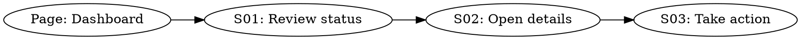

# Baseline текущих сценариев

Файл: `docs/product/current-scenario-baseline.md`

Используется в режиме `baseline`, чтобы зафиксировать существующий продукт до проектирования инкрементов. Baseline не заменяет scenario-файлы; он показывает текущую карту пользовательских путей, страниц, команд, API и границ продукта.

Сценарные user stories и regression paths фиксируются отдельно в `docs/product/scenario-cards.md` по шаблону [scenario-card-template.md](scenario-card-template.md).

````markdown
# Current Scenario Baseline

## Назначение

Кратко: какой продукт/область фиксируем, для каких будущих инкрементов этот baseline является опорой.

## Источники evidence

| Область | Evidence paths | Confidence | Unknowns |
| --- | --- | --- | --- |
| UI / pages | `path/to/file` | high/medium/low | ... |
| API / commands | `path/to/file` | high/medium/low | ... |
| Runtime / tests | `path/to/file` | high/medium/low | ... |

## Сценарии baseline

| ID | Scenario | Status | Persona | Entry | Exit / next | Surfaces | Notes |
| --- | --- | --- | --- | --- | --- | --- | --- |
| S01 | <Название> | current / legacy / external | <persona> | <page/command/API> | <S02/end> | <paths> | <known gap> |

## DOT-граф

Канонический DOT хранится рядом: `docs/product/scenario-graph.dot`.

Компактные пользовательские истории и точки расширения хранятся рядом: `docs/product/scenario-cards.md`.

Минимальный формат:



## Инварианты baseline

- Каждый current-сценарий имеет entry и exit / next.
- Каждый новый сценарий будущего инкремента должен иметь вход из baseline и возврат/следующий шаг.
- Legacy/external сценарии допустимы, но их границы должны быть названы явно.
- Висячий узел в DOT допустим только с объяснением в Notes.
````

## Обновление baseline

- После Phase 1 нового продукта создай первичный baseline из approved scenario-файлов.
- Перед инкрементом существующего продукта найди или создай baseline до написания implementation plan.
- При изменении сценария обнови таблицу baseline, scenario card и DOT в том же раунде, что и scenario-файл.
